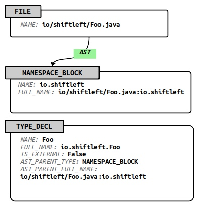
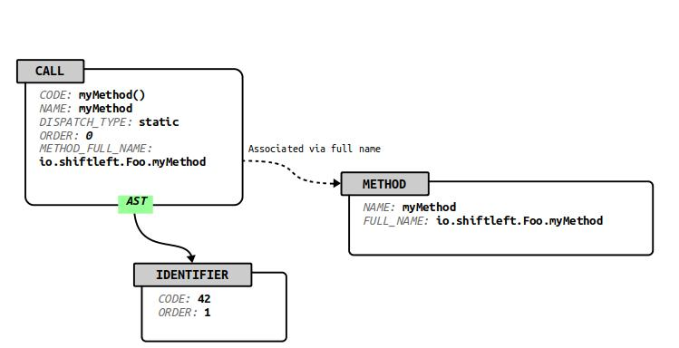

[](http://travis-ci.org/ShiftLeftSecurity/codepropertygraph)
[](https://bintray.com/shiftleft/maven/codepropertygraph/_latestVersion)
[](https://maven-badges.herokuapp.com/maven-central/io.shiftleft/codepropertygraph_2.13)

# Code Property Graph - Specification and Tooling

**Note: for first-time users, we recommend building "joern" at https://github.com/ShiftLeftSecurity/joern/ instead. It combines this repo with a C/C++ language frontend to construct a complete code analysis platform.**

A Code Property Graph (CPG) is an extensible and language-agnostic
representation of program code designed for incremental and
distributed code analysis. This repository hosts the base
specification together with a build process that generates data
structure definitions for accessing the graph with different
programming languages.


We are publishing the Code Property Graph specification as a
suggestion for an open standard for the exchange of code in
intermediate representations along with analysis results. With this
goal in mind, the specification consists of a minimal base schema that
can be augmented via extension schemas to enable storage of
application-specific data.

# Usage as a dependency
`build.sbt`:
```
libraryDependencies += "io.shiftleft" %% "codepropertygraph" % "x.y.z"
```

# Building the code

*Note*: for first-time users, we recommend building "joern" at https://github.com/ShiftLeftSecurity/joern/ instead. It contains a code property graph generator for C/C++, a component for querying the code property graph, as well as a few helpful examples to get started.

The build process has been verified on Linux and it should be possible
to build on OS X and BSD systems as well. The build process requires
the following prerequisites:

* Java runtime 8
  - Link: http://openjdk.java.net/install/
* Scala build tool (sbt)
  - Link: https://www.scala-sbt.org/
* Git-lfs
  - Link: https://git-lfs.github.com/
* Protoc
  - Link: https://github.com/protocolbuffers/protobuf/releases

Some binary files required for testing are managed through `git-lfs`. If you haven't cloned this repository yet, simply run `git lfs install`.
If you have cloned it already, additionally run `git lfs pull` (from within the repository).

Additional build-time dependencies are automatically downloaded as
part of the build process. To build and install into your local Maven
cache, issue the command `./publishLocal.sh`.

This command will install the following artifacts:

* _codepropertygraph-VERSION.jar_: Java and Scala classes to be used in combination with the ShiftLeft Tinkergraph [3].

* _codepropertygraph-protos-VERSION.jar_: Java bindings for Google's Protocol Buffer definitions

# Creating Protocol Buffer bindings for different languages

The _codepropertygraph-VERSION.jar_ artifact contains a Protocol Buffer definition file _cpg.proto_ that you
can use to generate your own language-specific bindings. For instance, to create C++ and Python bindings, issue the following series of commands:

```
sbt package
cd codepropertygraph/target
unzip codepropertygraph-*.jar cpg.proto
mkdir cpp python
protoc --cpp_out=cpp --python_out=python cpg.proto
```

# Base schema for the Code Property Graph

You can find the code property graph specification in [base.json](codepropertygraph/src/main/resources/schemas/base.json). A high level description is present in 

https://docs.shiftleft.io/core-concepts/code-property-graph

<!-- # Extending the specification -->

<!-- The build process creates the final graph schema by merging all JSON -->
<!-- files in the directory `src/main/resources/schemas/`. This makes it -->
<!-- possible for developers of program analysis tools to extend the graph -->
<!-- definition by providing additional JSON files. On the graph side, it -->
<!-- also provides the basis for augmenting the graph with additional -->
<!-- layers later in the processing pipeline for code analysis systems. -->


# Loading a codepropertygraph

Here's how you can load a cpg into ShiftLeft Tinkergraph [3] in the sbt console - the next section will list some queries you can interactively run from there.

There are some sample cpgs in this repository in the `resources/cpgs` directory.
You can run `./regenerate-test-cpgs.sh` to update them, but this requires the proprietary java2cpg installed locally.

### [Tinkergraph (in memory reference db)](http://tinkerpop.apache.org/docs/current/reference/#tinkergraph-gremlin)
```
sbt semanticcpg/console
```
```scala
val cpg = io.shiftleft.codepropertygraph.cpgloading.CpgLoader.load("./resources/cpgs/helloshiftleft/cpg.bin.zip")
```

# Querying the cpg

Once you've loaded a cpg you can run queries, which are provided by the `query-primitives` subproject. Note that if you're in the sbt shell you can play with it interactively: `TAB` completion is your friend. Otherwise your IDE will assist.

Here are some simple traversals to get all the base nodes. Running all of these without errors is a good test to ensure that your cpg is valid:

```scala
cpg.literal.toList
cpg.file.toList
cpg.namespace.toList
cpg.types.toList
cpg.methodReturn.toList
cpg.parameter.toList
cpg.member.toList
cpg.call.toList
cpg.local.toList
cpg.identifier.toList
cpg.argument.toList
cpg.typeDecl.toList
cpg.method.toList
```

From here you can traverse through the cpg. The query-primitives DSL ensures that only valid steps are available - anything else will result in a compile error:

```scala
cpg.method.name("getAccountList").parameter.toList
/* List(
 *   MethodParameterIn(Some(v[7054781587948444580]),this,0,this,BY_SHARING,io.shiftleft.controller.AccountController,Some(28),None,None,None),
 *   MethodParameterIn(Some(v[7054781587948444584]),request,2,request,BY_SHARING,javax.servlet.http.HttpServletRequest,Some(28),None,None,None),
 *   MethodParameterIn(Some(v[7054781587948444582]),response,1,response,BY_SHARING,javax.servlet.http.HttpServletResponse,Some(28),None,None,None)
 *   )
 **/

cpg.method.name("getAccountList").definingTypeDecl.toList.head
// TypeDecl(Some(v[464]),AccountController,io.shiftleft.controller.AccountController,false,List(java.lang.Object))
```

### Base Schema Specification

The base schema provides the minimum requirements all valid CPGs must satisfy. The base specification is concerned with three aspects of the program:

* Program structure
* Type declarations
* Method declarations

where a declaration comprises a formal signature, along with defining content such as a method body for methods or a literal value in the definition of a variable.

Property graphs alone are comparable in generality to hash tables and linked lists. To tailor them towards storing, transmitting, and analyzing code, the main challenge is to specify a suitable graph schema. In particular, a schema must define the valid node and edge types, node and edge keys, together with each of their domains. Finally, a schema puts constraints on the edges that may connect nodes, depending on their type.


The base schema of the CPG is specified in the JSON file `base.json`. The file contains a JSON object with the following members:

* `nodeKeys/edgeKeys`. List of all valid node/edge attributes. Each list element is an object specifying the attribute's ID, name, its type, and a comment.

* `nodeTypes/edgeTypes`. List of all node/edge types (i.e. edge labels in the original property graph definition), where each node/edge type is given by an object that specifies an ID, name,keys, comment, and, for node types (each note is required to have a mandatory note type, represented by a node attribute), valid outgoing edge types.

There are 19 node types across five categories:

| **Category** | **Names** |
| - | - |
| Program structure | FILE, NAMESPACE_BLOCK |
| Type declarations | TYPE_DECL, TYPE_PARAMETER, MEMBER, TYPE, TYPE_ARGUMENT |
| Method header | METHOD, METHOD_PARAMETER_IN, METHOD_RETURN, LOCAL, BLOCK, MODIFIER |
| Method body | LITERAL, IDENTIFIER, CALL, RETURN, METHOD_REF |
| Meta data | META_DATA |

There are eight edge types:

| **Name** | **Usage** |
| - | - |
| AST | Syntax tree edge - structure |
| CFG | Control flow edge - execution order and conditions |
| REF | Reference edge - references to type/method/identifier declarations |
| EVAL_TYPE | Type edge - attach known types to expressions |
| CALL | Method invocation edge - caller/callee relationship |
| VTABLE | Virtual method table edge - represents vtables |
| INHERITS_FROM | Type inheritance edge - models OOP inheritance |
| BINDS_TO | Binding edge - provides type parameters |

There are 17 node keys across three categories:

| **Category** | **Names** |
| - | - |
| Declarations | NAME, FULL_NAME, IS_EXTERNAL |
| Method header | SIGNATURE, MODIFIER_TYPE |
| Method body | PARSER_TYPE_NAME, ORDER, CODE, DISPATCH_TYPE, EVALUATION_STRATEGY,LINE_NUMBER, LINE_NUMBER_END, COLUMN_NUMBER,COLUMN_NUMBER_END, ARGUMENT_INDEX |
| Meta data | LANGUAGE, VERSION |

There are zero edge keys in the base specification.

Notice the deviation from the JSON standard by allowing inline comments. Any line for which the first two non-whitespace characters are equal to `/` are treated as comments, and need to be stripped prior to passing the definitions to standard JSON parsers.

## Program Structure

Node types: FILE, NAMESPACE_BLOCK

Program structure is concerned with the organization of programs into files, namespaces, and packages. A program is composed of zero or more files (type FILE), each of which contains one or more namespace blocks (type NAMESPACE_BLOCK). Namespace blocks contain type and method declarations (type TYPE_DECL and METHOD). Abstract syntax tree (AST) edges must exist from files to namespace blocks. Structural elements below namespace blocks are not connected to their AST parents by an edge. Instead the AST_PARENT_TYPE and AST_PARENT_FULL_NAME properties are used to inform the backend about the
AST relation of methods (type METHOD) and type declarations (type TYPE_DECL) to their parents. The property FULL_NAME thereby must be a unique identifier for the three node types METHOD, TYPE_DECL and NAMESPACE_BLOCK. This figure shows how a
Java class definition is represented in a CPG.



The concept of namespace blocks correspond to the equivalent concepts in the C++ programming language, where namespace blocks are used to place declarations into a namespace. Other languages, e.g., Java or Python, do not provide the same type of namespace blocks. However, they allow package declarations at the start of source files that serve the
purpose of placing all remaining declarations of the source file into a namespace. Package declarations are translated into corresponding namespace blocks for these languages. So the name of a namespace block is the complete namespace of all the elements within the block and the full name of a namespace block is a unique identifier for a specific block. For Java, it is enough to prefix the file name to the namespace because there is only one namespace describing package statement per file.

## Type Declarations

Node types: TYPE_DECL, TYPE_PARAMETER, MEMBER, TYPE, TYPE_ARGUMENT

Language constructs are expressed that declare types via *type declarations*. Examples of these constructs include classes, interfaces, structures, and enumerations. A type declaration consists of a name, an optional list for type parameters, member variables and methods. Inheritance relations with other types may be encoded in *type declarations*.


In the CPG, each type declaration is represented by a designated type-declaration node (type TYPE_DECL), with at least a
full-name attribute. Member variables (type MEMBER), method declarations (type METHOD), and type parameters (type TYPE_PARAMETER) are connected to the type declaration via AST edges, originating at the type declaration. Inheritance relations are expressed via INHERITS_FROM edges to zero or more other type declarations (type TYPE_DECL), which indicate that the source type declaration inherits from the destination declaration.

Usage of a type, for example in the declaration of a variable, is indicated by a type node (type TYPE). The type node is connected to the corresponding type declaration via a reference edge (type REF), and to type arguments through AST edges (type AST). Type-argument nodes are connected to type parameters by binding edges (type BINDS_TO).

## Method Declarations

A method declaration consists of a method header and a method body, where the declaration is a CPG representation of the method's input and output parameters, and the method body contains the
instructions/statements of the method.

### Method Header

Node types: METHOD, METHOD_PARAMETER_IN, METHOD_RETURN, LOCAL, BLOCK, MODIFIER

The term *method* is used in object-oriented programming languages to refer to a procedure that is associated with a class. The term is used here in a broader sense to refer to any named block of code. This code may or may not be defined to be associated with a type. The method consists of a method header and a method body. The method header is given by a name, a formal return parameter and a list of formal input parameters and corresponding output parameters. The method body is simply a block of statements.


In the CPG, each method is represented by a designated method node (type METHOD) that contains the method name in particular. Methods are connected to their method input parameters (type METHOD_PARAMETER_IN), return parameter (type METHOD_RETURN), modifiers (type MODIFIER) and locals (type LOCAL) through AST edges. The method node is connected to a block node (type BLOCK), which represents the method body.

### Method Body

Node types: LITERAL, IDENTIFIER, CALL, RETURN, METHOD_REF

Method bodies contain the method implementation, given by the operations the method carries out. Method bodies are represented as Control Flow graphs over method invocations, a representation used to provide a common ground for the instruction, statement, and expression concepts used across machine-level and high-level programming languages. The core elements of the method body representation are thus method invocations ("calls") and control flow edges.

In the CPG, a method invocation is represented by a designated call node (type CALL). Arguments are either identifier (type IDENTIFIER), literals (type LITERAL), other calls (type CALL) or method references (type METHOD_REF). Each argument has an argument index property (type ARGUMENT_INDEX) to indicate with which parameter it is associated. Calls are connected to their arguments through outgoing AST edges, and are associated to the called method via their METHOD_FULL_NAME property.



In addition to identifiers, literals and calls, method references (type METHOD_REF) are allowed to represent locations in the code where a method is not called, but referenced, as is the case for programming languages where methods are first-class citizens. Method references are connected to method instances by reference edges (type REF).

Return nodes (type RETURN) are created for each location in the method body where control is returned to the caller. Unconditional control flow edges are created from preceding calls to return nodes. All remaining nodes are connected by control flow edges (type CFG) according to execution order and constraints. The method node is treated as the entry node of the Control Flow graph. Finally, a designated block node (type BLOCK) is created for the method body, and creates  outgoing AST edges to all expressions that correspond to statements.

### Background on the Method Body Representation

In machine-level languages, procedure bodies are defined by instructions and connected by control flow edges to form a Control Flow graph. Each instruction represents an operation carried out by the machine, which can modify the program state. In contrast, higher-level languages (C and above) typically eliminate the instruction concept in favor of statements. As for instructions, statements can modify the program state. They differ from instructions in that they can consist of multiple expressions. Expressions are anonymous blocks of code that receive input and produce an output value upon evaluation. Inputs to an expression can be literals and identifiers, but they may also be other expressions. In fact, the semantics of statements can be fully encoded via expression trees, and control flow edges attached to the roots of these trees, to represent the statement's control flow semantics.

The ability of a statement to represent several expressions allows for concise program formulation. However, it presents challenges to program analysis. While it is possible to create a Control Flow graph by introducing control flow edges between statements, this graph does not encode the intra-statement control flow. Fortunately, the tree combined
with disambiguation rules of the programming language fully encodes the evaluation order of expressions within a statement. This allows unambiguously representation of their evaluation order with control flow edges.

Expressions consist of method evaluations and applications of operators provided by the language. By expressing operators as methods, and allowing methods to receive the return values of other methods as input, all expressions can be represented as method invocations. A program representation for the method body is thus produced, which consists of method invocations connected by control flow edges.

## Meta Data Block

A metadata block (type META_DATA) is included in CPG with two fields: a language field (key LANGUAGE) to indicate the  programming language from which the graph was generated, and a version field (key VERSION) holding the specification version. Both fields are free-text strings.


# References

[1]  Rodriguez and Neubauer - The Graph Traversal Pattern:
    https://pdfs.semanticscholar.org/ae6d/dcba8c848dd0a30a30c5a895cbb491c9e445.pdf

[2] Yamaguchi et al. - Modeling and Discovering Vulnerabilities with Code Property Graphs
    https://www.sec.cs.tu-bs.de/pubs/2014-ieeesp.pdf

[3] The ShiftLeft Tinkergraph
    https://github.com/ShiftLeftSecurity/tinkergraph-gremlin

